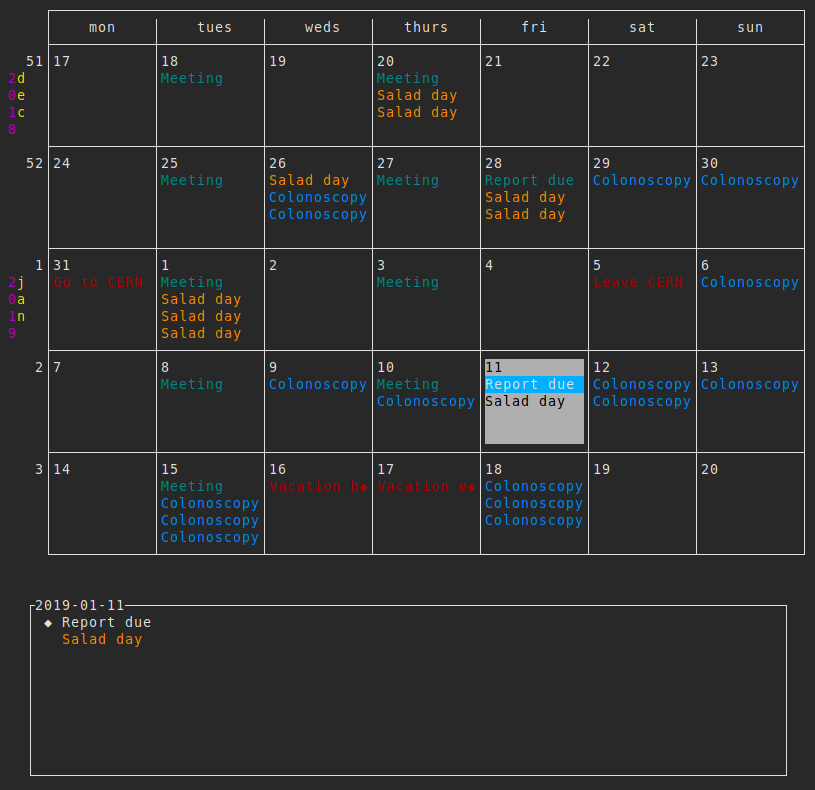

# isoplan
IsoPlan is a curses based ISO/week number calendar 

## Features:
* vim-like navigation, should become more vim-like over time
* Every modification saved immediately (it's okay to run multiple instances)
* Python configuration file `settings.py`

## Screen shot:

